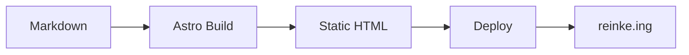
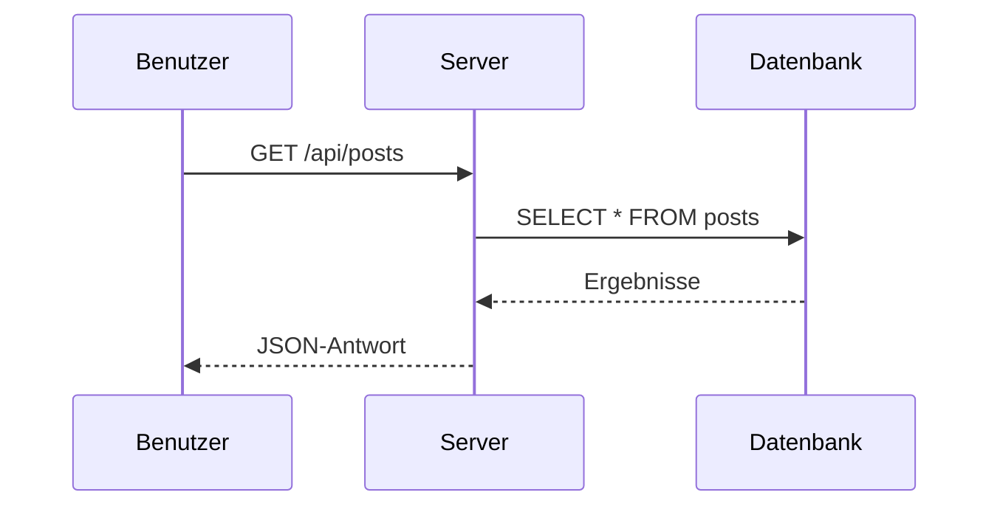
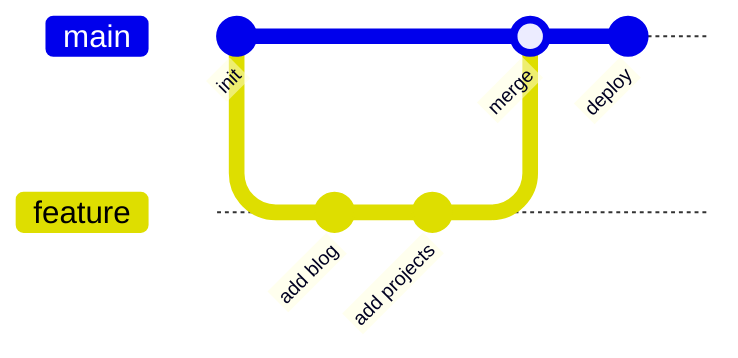

Dieser Beitrag demonstriert alles, was Sie in Blog-Artikeln verwenden können.

## Textformatierung

Regulärer Absatztext mit **fett**, *kursiv*, ~~durchgestrichen~~ und `Inline-Code`. Sie können auch **_fett kursiv_** Text kombinieren.

> Blockzitate sind nützlich, um wichtige Informationen hervorzuheben oder externe Quellen zu zitieren. Sie können sich über mehrere Zeilen erstrecken.
>
> Sogar über mehrere Absätze.

## Links

- [Externer Link zu GitHub](https://github.com/xi72yow)
- [Ein weiterer Link](https://reinke.ing)

## Bilder


Bilder werden responsiv gerendert und erhalten automatisch abgerundete Ecken.

## Codeblöcke

Inline: Verwenden Sie `npm install`, um Abhängigkeiten zu installieren.

Eingezäunter Block mit Syntaxhinweis:

```rust
fn main() {
    let message = "Hello from reinke.ing";
    println!("{message}");

    let numbers: Vec<i32> = (1..=10)
        .filter(|n| n % 2 == 0)
        .collect();

    for n in &numbers {
        println!("Even: {n}");
    }
}
```

```typescript
interface BlogPost {
  title: string;
  date: Date;
  tags: string[];
  draft: boolean;
}

async function fetchPosts(): Promise<BlogPost[]> {
  const response = await fetch("/api/posts");
  return response.json();
}
```

```bash
# Deploy-Skript
docker build -f Containerfile -t my-app .
docker run -d -p 3000:3000 my-app
echo "Erfolgreich bereitgestellt"
```

## Listen

Ungeordnet:

- Erstes Element
- Zweites Element mit einer längeren Beschreibung, die in die nächste Zeile umbricht, um zu zeigen, wie Listenelemente längere Textinhalte behandeln
- Drittes Element
  - Verschachteltes Element A
  - Verschachteltes Element B

Geordnet:

1. Schritt eins
2. Schritt zwei
3. Schritt drei

## Tabellen

| Werkzeug | Sprache | Anwendungsfall |
|----------|---------|----------------|
| Astro | TypeScript | Statische Websites |
| UnoCSS | CSS | Utility-first Styling |
| Sharp | C/Node | Bildverarbeitung |
| Marked | JavaScript | Markdown-Rendering |

## Details / Ausklappbar

<details>
<summary>Klicken, um zu erweitern</summary>

Versteckter Inhalt geht hier hin. Nützlich für lange Codebeispiele, Logs oder ergänzende Informationen, die den Hauptfluss stören würden.

```json
{
  "name": "reinke-portfolio",
  "version": "1.0.0",
  "type": "module"
}
```

</details>

## Überschriften-Hierarchie

### H3 Unterüberschrift

Inhalt unter H3.

#### H4 Unterüberschrift

Inhalt unter H4.

## Diagramme (Mermaid)

Mermaid-Diagramme werden clientseitig gerendert. Umschließen Sie Ihr Diagramm mit einem eingezäunten Codeblock mit dem `mermaid` Sprach-Tag.

Flussdiagramm:



Sequenzdiagramm:



Git-Graph:



## Horizontale Linien

Verwenden Sie `---`, um visuelle Trennlinien zwischen Abschnitten zu erstellen:

---

Das deckt alle wichtigen Markdown-Funktionen ab. Schreiben Sie Ihre Beiträge in `src/content/blog/` und sie werden automatisch angezeigt.
