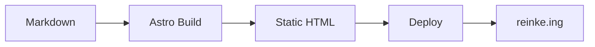
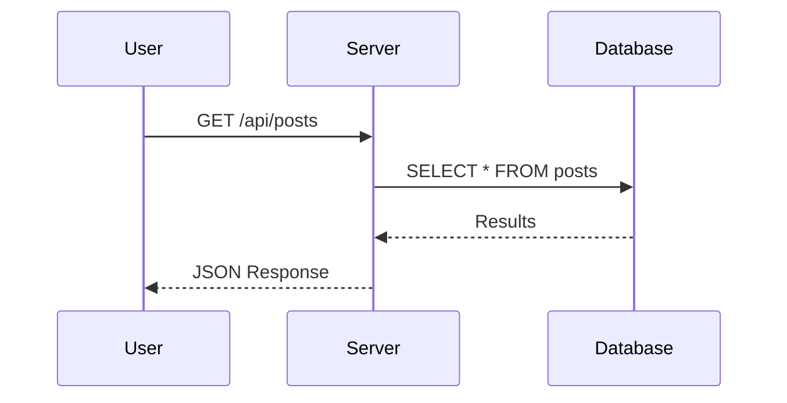
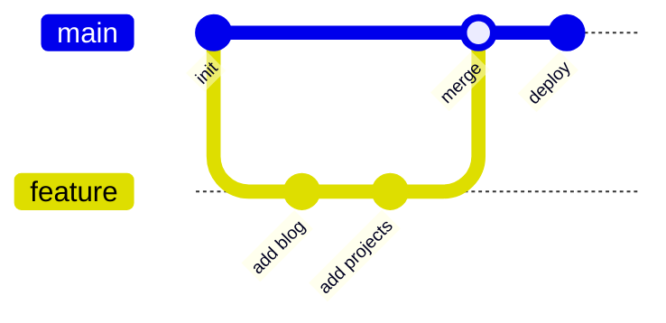

This post demonstrates everything you can use in blog articles.

## Text Formatting

Regular paragraph text with **bold**, *italic*, ~~strikethrough~~, and `inline code`. You can also combine **_bold italic_** text.

> Blockquotes are useful for highlighting important information or quoting external sources. They can span multiple lines.
>
> Even multiple paragraphs.

---

## Links

- [External link to GitHub](https://github.com/xi72yow)
- [Another link](https://reinke.ing)

## Images


Images are rendered responsive and get rounded corners automatically.

## Code Blocks

Inline: use `npm install` to install dependencies.

Fenced block with syntax hint:

```rust
fn main() {
    let message = "Hello from reinke.ing";
    println!("{message}");

    let numbers: Vec<i32> = (1..=10)
        .filter(|n| n % 2 == 0)
        .collect();

    for n in &numbers {
        println!("Even: {n}");
    }
}
```

```typescript
interface BlogPost {
  title: string;
  date: Date;
  tags: string[];
  draft: boolean;
}

async function fetchPosts(): Promise<BlogPost[]> {
  const response = await fetch("/api/posts");
  return response.json();
}
```

```bash
# Deploy script
docker build -f Containerfile -t my-app .
docker run -d -p 3000:3000 my-app
echo "Deployed successfully"
```

## Lists

Unordered:

- First item
- Second item with a longer description that wraps to the next line to show how list items handle longer text content
- Third item
  - Nested item A
  - Nested item B

Ordered:

1. Step one
2. Step two
3. Step three

## Tables

| Tool | Language | Use Case |
|------|----------|----------|
| Astro | TypeScript | Static sites |
| UnoCSS | CSS | Utility-first styling |
| Sharp | C/Node | Image processing |
| Marked | JavaScript | Markdown rendering |

## Details / Collapsible

<details>
<summary>Click to expand</summary>

Hidden content goes here. Useful for long code examples, logs, or supplementary information that would clutter the main flow.

```json
{
  "name": "reinke-portfolio",
  "version": "1.0.0",
  "type": "module"
}
```

</details>

## Headings Hierarchy

### H3 Subheading

Content under H3.

#### H4 Subheading

Content under H4.

## Diagrams (Mermaid)

Mermaid diagrams are rendered client-side. Wrap your diagram in a fenced code block with the `mermaid` language tag.

Flowchart:



Sequence diagram:



Git graph:



## Horizontal Rules

Use `---` to create visual separators between sections:

---

That covers all the main markdown features. Write your posts in `src/content/blog/` and they show up automatically.
