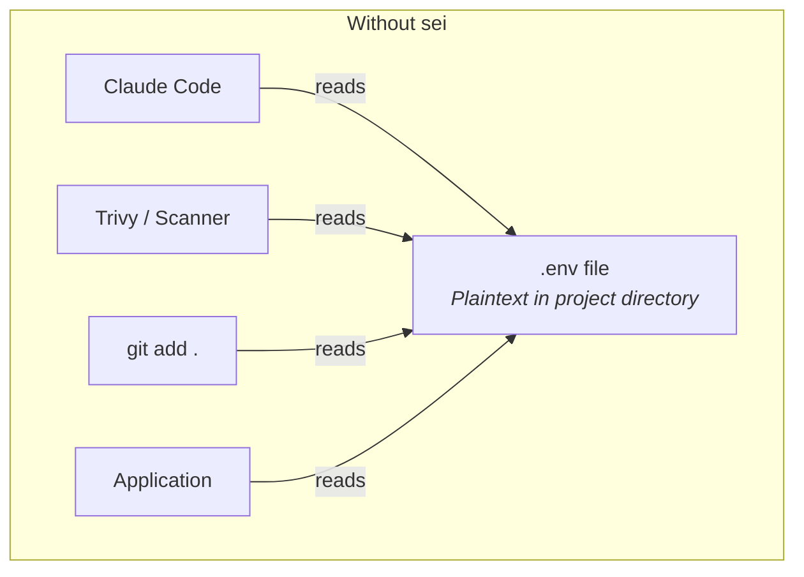
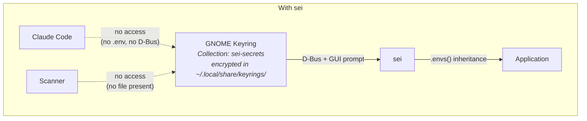
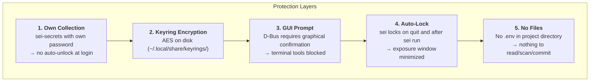

# sei - Save Env Inject

> *You don't leave your front door open just because you'll need to get back in tomorrow.*

Manages environment secrets in GNOME Keyring instead of `.env` files. TUI for editing, CLI for injection.

## Why?

`.env` files sit in the project directory — any tool with file access can read them:

- **AI agents** (Claude Code, Copilot) read project files for context analysis
- **Security scanners** with vulnerabilities (e.g. Trivy — secrets were exfiltrated)
- **CI/CD pipelines** and build tools scan the working directory
- **`git add .`** accidentally commits secrets

`sei` stores secrets in GNOME Keyring — encrypted, protected by GUI prompt, invisible to file-based tools.

## Architecture





## Installation

### Script (recommended)

```bash
curl -fsSL https://xi72yow.github.io/sei/install.sh | sudo bash
```

This adds the sei APT repository and installs the package. Updates come via `apt upgrade`.

### Manual (build from source)

Requires Podman.

```bash
git clone https://github.com/xi72yow/sei.git
cd sei
./build.sh --install
```

Or build only and install separately:

```bash
./build.sh
sudo apt install --reinstall ./dist/sei_*.deb
```

### Prerequisite

A running Secret Service daemon — GNOME Keyring (`gnome-keyring-daemon`), KeePassXC, or any other daemon implementing the [freedesktop Secret Service API](https://specifications.freedesktop.org/secret-service/latest/).

## Usage

### TUI

```bash
sei
```


On startup, `sei` scans for `.env*` files in the current directory. If new or changed files are found, the **Import** tab opens automatically with a diff view. Stage names are derived from the file suffix (`.env` → default, `.env.production` → production).

After import, the **Store** tab shows all keyring entries:


Each entry gets a **3-digit ID** (001–999) for quick CLI access. Entries matching the current directory are highlighted. All keybindings are shown in the footer.

### Running Commands

```bash
# Inline picker — choose entry interactively
sei node server.js

# By ID (skip picker)
sei 001 node server.js
sei 002 podman compose up -d

# By path + stage
sei run -s production -- node server.js
sei run -p ~/projects/api -s prod -- node server.js

# -- only needed when cmd starts with a flag
sei run --id 001 -- --some-flag
```


When no ID is given, `sei` shows an inline picker to select an entry before running the command. Entries matching the current directory are shown first.

Secrets are passed via environment inheritance — no temp files, no CLI arguments. The keyring is locked after loading.

### Compose Integration

`sei` injects env vars into the process it spawns. For Compose, reference the variables in your `compose.yml`:

```yaml
services:
  app:
    image: myapp
    environment:
      - DB_HOST        # value from host env (set by sei)
      - DB_PORT
      - API_KEY
```

```bash
sei 001 podman compose up -d
```

## Security Model



| Attack Vector | Without sei | With sei |
|---------------|-------------|----------|
| AI agent reads project files | `.env` directly readable | No file present |
| AI agent uses `secret-tool` | — | GUI prompt blocks terminal |
| Scanner exfiltrates secrets | `.env` is found | Nothing on disk |
| `git add .` / `git commit -a` | `.env` gets committed | Nothing to commit |
| Shoulder surfing | `.env` open in editor | Values masked |
| Process monitoring (`ps`) | — | Secrets not in CLI arguments |
| Root access / disk forensics | `.env` plaintext | Keyring encrypted |

## Technical Details

- **Language:** Rust (no `unsafe`)
- **TUI:** ratatui + ratatui-textarea + crossterm
- **Keyring:** zbus (D-Bus, freedesktop Secret Service API, pure Rust)
- **Collection:** `sei-secrets` (own collection, own password)
- **Metadata:** 3-digit ID, created/updated timestamps per entry
- **Async:** tokio + futures-util
- **CLI:** clap (derive) + ID shorthand
- **Build:** Container-based via Podman
- **Package:** `.deb` for amd64 (stripped, LTO)

## License

Not yet licensed. All rights reserved.